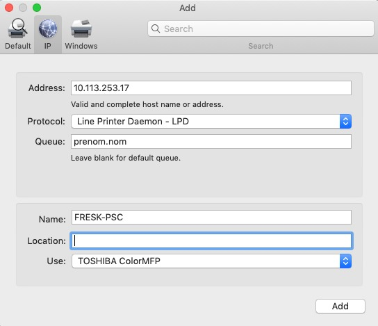

## Installing the printer on Mac

Procedure for installing the printer on Mac:

* first download and install the driver [here](https://downloads.toshibatec.eu/publicsite-service/resource/download/pseu/en/82d76edc-94ac-4be3-bff8-5df869227837/a9d700ac68ca348fcd83adea3b3b2bac/TOSHIBA%20e-STUDIO%20MacPPD_10.7.x-11.x_%20v7.113.0.4.zip);
* unzip the file;
* unpack and run the install `MacPPD/OSX10_7-/normal/TOSHIBA_ColorMFP.dmg.gz`;
* then go to "settings/Printers" and add a printer;
* go to IP tab and enter the info below, replacing "prenom.nom" by your login (without the parisantecampus.net) :

* then send your printing job, go to the printer, and scan you badge (there's an icon);
* The printer will ask for you login and password (the same as for internet). After you've done that, you can tap on "impression" and select and print your job.
(the prompt for login and password is only the first time you print, after which you badge will be associated to your account)

## Printer policy
Each one has 1000 credits: 
* 1 BW page = 1 credit;
* 1 color page = 3 credits.
